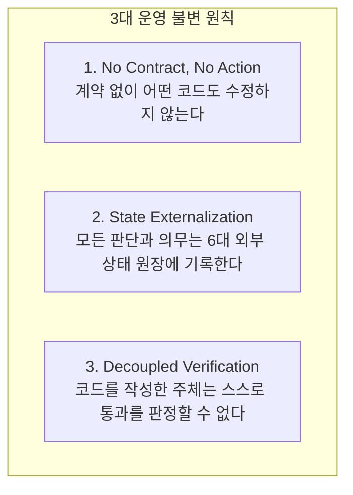
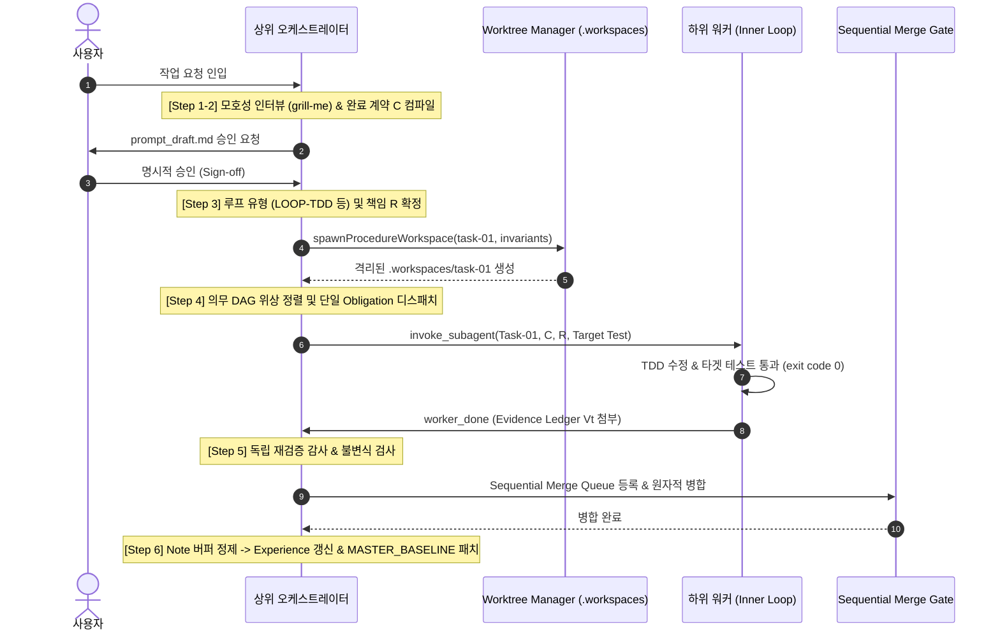

# 논리 완결 하네스 및 상위 오케스트레이터 표준 운영 가이드
## (Logical Completion Harness & Orchestrator Operations Guide)

> **문서 버전**: v1.0 (Canonical Operations Standard)  
> **적용 대상**: 플랫폼 운영자, 상위 오케스트레이터 에이전트, 하위 워커 에이전트  
> **핵심 사양**: 6대 외부 상태 런타임 하네스 ($S_t = (C, B_t, P_t, E_t, V_t, R_t)$), 2계층 루프 매트릭스, Git-Native 워크트리 격리  

---

## 🏛️ 1. 운영 개요 및 3대 불변 원칙

본 가이드는 모델 내부의 암묵적 추론(Implicit CoT)과 자가 인증(Self-Certification)을 완전히 배제하고, **명시적 외부 상태 원장**과 **기계적 강제 검증 게이트**를 통해 실패 없는 작업을 보장하는 표준 운영 절차서(SOP)입니다.



---

## 🚀 2. 상위 오케스트레이터의 6단계 표준 운영 플레이북 (Orchestration SOP)

상위 오케스트레이터는 직접 코드를 구현하지 않고, **계약자, 경계 관리자, 심판, 릴리스 통제관**으로서 다음 6단계를 엄격히 순차 실행합니다.



### [Step 1] 요구사항 인입 및 모호성 압박 인터뷰 (`grill-me`)
1. 사용자 요청을 접수하면 즉시 코딩을 시작하지 않고 `antigravity-builtin/grill-me` 스킬을 기동합니다.
2. `ask_question` 도구를 통해 **데이터 모델, 동시성, 비기능 요구사항, 비목표(Non-goals)**를 질의합니다.
3. 실시간 아티팩트 `prompt_draft.md`를 생성하여 요구사항 초안을 동기화합니다.

### [Step 2] 완료 계약($C$) 컴파일 및 사용자 승인 게이트
1. 다음 필수 필드를 포함하는 완료 계약($C$)을 컴파일합니다:
   * `goal`: 최종 달성 상태
   * `deliverables`: 필수 생성/수정 파일
   * `acceptance_tests`: 기계적으로 판정 가능한 검증 명령어 (예: `npm test -- test/target.test.js`)
   * `constraints`: 수정 허용 범위(`allowed_change_scope`), 금지 행위
   * `non_goals`: 이번 범위에서 제외되는 항목
2. **승인 게이트**: 사용자의 명시적 승인("go", "launch", "진행해")이 떨어지기 전에는 하위 워커를 절대로 기동하지 않습니다.

### [Step 3] 루프 아키타입 결정 및 물리적 워크트리 격리
1. [루프 판별 결정 트리](../../docs/guides/loop-types-and-skill-presets-matrix.md#2-루프-유형-자동-판별-결정-트리-dynamic-routing-decision-tree)에 따라 루프 유형을 지정합니다.
2. `platform-core/worktree-lifecycle-orchestrator`를 호출하여 `.workspaces/<task_id>`에 격리된 Git 워크트리를 생성합니다.
3. `owned_files` 외의 파일 쓰기를 차단하는 스코프 불변식(`scope-boundary-enforcer`)을 워크스페이스에 바인딩합니다.

### [Step 4] 의무 DAG 스케줄링 및 단일 의무 디스패치
1. 완료 계약의 수용 조건을 달성하기 위한 의무 목록($O_1, O_2, \dots$)을 위상 정렬(Topological Sort)합니다.
2. 선행 조건이 충족된 단 1개의 활성 의무(`active obligation`)를 하위 워커에게 디스패치합니다.
3. 워커 호출 시 재귀 깊이를 `depth <= 3`, 동시 워커를 `<= 4`로 제한합니다.

### [Step 5] 독립 수용 검증 및 순차 병합 게이트 (Sequential Merge)
1. 하위 워커가 `worker_done`을 보고하면, 워커의 자가 주장을 신뢰하지 않고 오케스트레이터가 직접 타겟 테스트를 독립 재실행합니다.
2. 스코프 밖 파일 수정 여부(`git status --porcelain`) 및 린트를 전수 검사합니다.
3. 검증을 100% 통과한 경우에만 Sequential Merge Queue를 통해 `main` 브랜치에 원자적 병합(Fast-Forward / Rebase)합니다.
4. 검증 실패 시 해당 워크트리를 즉시 폐기(Discard)하고 의무를 `reopen`합니다.

### [Step 6] 사후 메모리 정제 및 정본 패치 (Consolidation)
1. 모든 의무가 `satisfied` 상태에 도달하면 `close(contract_id)`를 실행합니다.
2. 임시 `note` 버퍼에 수집된 교훈들을 정제(중복 제거, 반례 추가, LFU 갱신)하여 `Experience ($E$)`에 등록합니다.
3. `MASTER_BASELINE.md` 및 `GEMINI.md`에 새로운 영구 룰을 패치 발행합니다.

---

## 🧠 3. 컨텍스트 관리 운영 수칙 (Context SOP)

### ① 에피스테믹 상태 관리 규격 (Epistemic Status)
컨텍스트 내의 모든 정보는 다음 4가지 상태로 엄격히 관리되어야 합니다:

| 상태 | 정의 | 처리 규칙 |
| :--- | :--- | :--- |
| **`observed`** | 환경(파일/도구 실행)에서 직접 확인된 사실 | 단일 진실 공급원(SSOT)으로 간주 |
| **`inferred`** | 관측 사실로부터 유도된 중간 결론 | 근거 참조(`evidence_refs`) 필수 |
| **`assumed`** | 증거가 없는 초기 가설 | 검증 전까지 정본으로 승격 금지 |
| **`contradicted`** | 새로운 관측과 충돌하여 무효화된 상태 | 즉시 폐기 및 관련 의무 Reopen |

> [!IMPORTANT]
> **Observation Trumps Memory (관측 사실의 절대 우선권)**  
> 과거 경험($E$)이나 이전 턴의 추론 내용이 현재 환경 관측 사실($B$)과 충돌할 경우, 시스템은 **과거 기억을 즉시 `contradicted`로 마킹하고 현재 관측 사실만을 유효한 진실로 채택**합니다.

### ② 선택적 Consult Policy 운영
매 턴마다 모든 메모리를 프롬프트에 주입하지 않고, 다음 조건에 부합할 때만 메타 액션을 호출합니다:
* **`track(subject)` 호출**: 직전 행동으로 파일/환경이 변경되었거나, 기존 관측이 stale 되었을 때.
* **`recall(query)` 호출**: 새로운 토픽에 진입했거나, 첫 번째 시도가 실패하여 대체 전략이 필요할 때.
* **`note(content)` 호출**: 반복 실패의 근본 원인을 찾았거나, 재사용 가능한 절차를 발견했을 때 (임시 버퍼 저장).

---

## 🛠️ 4. 하위 워커 실행 수칙 (Inner Loop Worker SOP)

1. **단일 Contiguous Block 수정**: `replace_file_content` 도구를 사용하여 최소한의 연속된 블록만 수정하며, 전체 파일 덮어쓰기(`write_to_file` overwrite)를 금지합니다.
2. **Test Storm Shield 준수**: 이너 루프 디버깅 중에는 무차별 전체 테스트(`npm test`)를 돌리지 않고, 오직 지정된 1:1 타겟 테스트(`run_scoped_test`)만 반복 실행합니다.
3. **의무 원장 전이 불변식**:
   ```text
   [pending] ──(작업 착수)──> [active] ──(독립 테스트 성공)──> [satisfied]
                                  │
                                  └──(불가피한 제외)──> [waived (명시적 증거 필수)]
   ```
4. **침묵형 실패 은폐 금지**: 테스트가 실패했을 때 임의로 테스트 코드를 약화시키거나 삭제하는 행위는 `CRITICAL_VIOLATION`으로 간주되어 세션이 즉시 차단됩니다.

---

## 🚨 5. 예외 처리 및 장애 복구 플레이북 (Failure Recovery SOP)

### Case 1: 타겟 테스트 실패 및 모순 발생 (Contradiction)
* **현상**: 코드를 수정했으나 타겟 테스트가 `exit code != 0`을 반환.
* **대응 절차**:
  1. 에이전트는 변명을 출력하지 않고, 기존 가정($B_t$)을 즉시 `contradicted`로 전이.
  2. 의무 상태를 `reopen(obligation_id)`하여 활성화.
  3. `recall`을 통해 유사 실패 패턴을 조회한 후 다른 가설로 수술적 수정 재시도.

### Case 2: 조기 자가 인증 시도 감지 (Premature Self-Certification)
* **현상**: 워커가 테스트 실행 도구 호출 없이 "코드가 완벽히 수정되었습니다"라며 종료 시도.
* **대응 절차**:
  1. 상위 오케스트레이터의 검증 게이트가 이를 감지하고 `close` 요청을 즉각 거부(Reject).
  2. `$V_t$ (Verification Record)` 부재 에러를 반환하고 실제 테스트 명령어 실행을 강제.

### Case 3: 스코프 이탈 파일 수정 감지 (Scope Creep)
* **현상**: 워커가 $R$ (`allowed_change_scope`)에 정의되지 않은 설정 파일이나 타 모듈을 임의 수정.
* **대응 절차**:
  1. 해당 워크트리의 변경 사항을 즉시 `git checkout .`으로 롤백.
  2. 워크스페이스를 폐기(Prune)하고, 권한 위반 경고와 함께 워커를 재기동.

---

## 📋 6. 3단계 운영 체크리스트 (Operational Checklists)

### 🛫 Pre-Flight Checklist (기동 전 검사)
- [ ] 사용자 요청의 모호성이 `grill-me`를 통해 100% 해소되었는가?
- [ ] 완료 계약($C$)에 객관적으로 측정 가능한 수용 테스트가 명시되었는가?
- [ ] 사용자의 명시적 승인(Approval)이 떨어졌는가?
- [ ] 독립된 Git 워크트리(`.workspaces/`)가 정상 프로비저닝되었는가?

### ✈️ In-Flight Checklist (실행 중 검사)
- [ ] 활성화된 수직 토픽이 오직 1개인가?
- [ ] 타겟 테스트만 실행되고 무차별 전체 테스트 스캔이 차단되고 있는가?
- [ ] 현재 관측 사실이 과거 기억보다 우선 적용되고 있는가?
- [ ] 수정 작업이 단일 contiguous diff로 안전하게 수행되는가?

### 🛬 Post-Flight Checklist (종료 및 병합 전 검사)
- [ ] 의무 원장($P_t$)에 미해결(`pending`/`active`/`blocked`) 의무가 0개인가?
- [ ] 상위 오케스트레이터의 독립 재검증(`exit code 0`)이 통과되었는가?
- [ ] 스코프 밖 파일 오염이 없는가?
- [ ] 임시 `note` 버퍼의 지식이 `Experience ($E$)`와 `MASTER_BASELINE.md`에 정제 반영되었는가?
