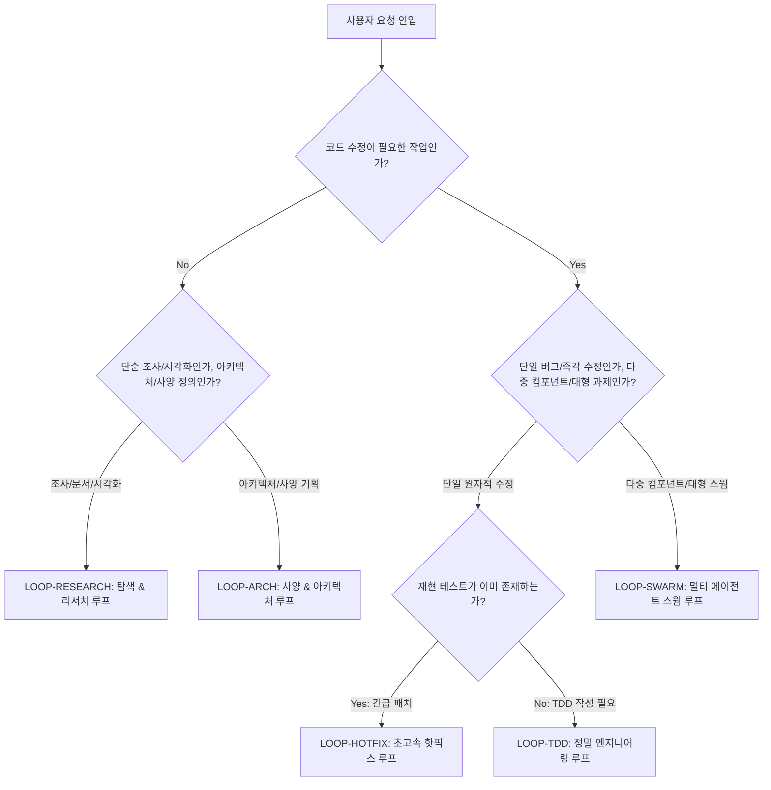

# 표준 루프 유형 및 스킬 프리셋 매트릭스 (Loop Archetype & Skill Preset Matrix)

> **상태**: Canonical Matrix Specification v1.1  
> **관리 주체**: Skills Platform Architecture & Governance  
> **목적**: 작업 유형별(TDD 개발, 아키텍처 기획, 리서치/탐색, 핫픽스, 멀티에이전트 스웜, 보안 감사)로 필수 페이즈 시퀀스와 게이트를 표준화하고, 그 위에 생태계별 최적 스킬 프리셋을 매핑하여 지속적으로 고도화(Extendable)할 수 있도록 관리하는 2계층 거버넌스 프레임워크.

---

## 🏛️ 1. 2계층 거버넌스 아키텍처 (Two-Layer Framework)

```text
+-----------------------------------------------------------------------------------------+
| [Layer 1] 표준 루프 유형 (Standardized Loop Archetypes)                                   |
|   - 작업 목적별 필수 페이즈 시퀀스, 강제 검증 게이트, 코드/테스트/UI 허용 여부 불변식 정의  |
+-----------------------------------------------------------------------------------------+
                                             ▲
                                             │ (루프 유형 위에 바인딩)
+-----------------------------------------------------------------------------------------+
| [Layer 2] 생태계별 스킬 프리셋 매트릭스 (Ecosystem Skill Presets)                         |
|   - Antigravity Native / Paperthin (re0) / Orca / Platform Core 스킬 바인딩             |
+-----------------------------------------------------------------------------------------+
```

---

## 🧭 2. 루프 유형 자동 판별 결정 트리 (Dynamic Routing Decision Tree)

에이전트 또는 운영자가 사용자 요청을 분석하여 최적의 루프 유형을 선택하는 의사결정 경로입니다.



---

## 🔄 3. 표준 루프 유형 인벤토리 (Standardized Loop Inventory)

| 루프 ID | 루프 명칭 | 표준 페이즈 시퀀스 | 핵심 강제 게이트 (Forcing Gate) | 코드 변경 | 테스트 필수 | UI 표출 |
| :--- | :--- | :--- | :--- | :---: | :---: | :---: |
| **`LOOP-TDD`** | **Full Engineering TDD** | `Plan` ➔ `Target Test` ➔ `Code` ➔ `Verify` ➔ `Release` | 1:1 타겟 테스트 `exit 0` + 회귀 테스트 통과 | **필수** | **필수** | 선택 |
| **`LOOP-ARCH`** | **Architecture & Spec** | `Elicit` ➔ `Grill/Probe` ➔ `Trade-off` ➔ `Document` | 사용자 명시적 승인 + 불변식 검증 | **금지** | **금지** | 텍스트/표 |
| **`LOOP-RESEARCH`** | **Exploratory & Research** | `Hypothesis` ➔ `Explore/Search` ➔ `Synthesize` ➔ `Visual Dashboard` | 공식 출처 인용(Citations) + 시각화 위젯 | 선택 | **불필요** | **필수** |
| **`LOOP-HOTFIX`** | **Surgical Fast-Path** | `Reproduce` ➔ `Minimal Diff` ➔ `Verify` | 단일 패치 검증 `exit 0` | **필수** | **필수** | ❌ |
| **`LOOP-SWARM`** | **Multi-Agent Swarm** | `Prompt Craft` ➔ `Approval Gate` ➔ `Swarm DAG` ➔ `Review` | 5-Agent Review Panel / `worker_done` 게이트 | **필수** | **필수** | **필수** |
| **`LOOP-AUDIT`** | **Security & Quality Audit** | `Scan` ➔ `Vulnerability Check` ➔ `Remediation Plan` | Zero Critical Findings + 비밀정보 미노출 | **금지** | 정적분석 | **필수** |
| **`LOOP-COMPLETION`** | **Logical Completion Harness** | `Contract (C)` ➔ `Explore (P)` ➔ `Consult/Act (B,E)` ➔ `Verify (V)` ➔ `Close` ➔ `Learn` | 100% Obligation Ledger 상태 완료 + 독립 증거 검증 | **가변** | **필수** | 선택 |

---

## 📊 4. 루프 유형 × 생태계 스킬 바인딩 매트릭스 (Total Matrix)

각 루프 유형에서 생태계 간 오염(Cross-Pollution) 없이 독립적으로 동작하는 스킬 바인딩입니다.

| 루프 ID | 🅰️ Antigravity Native | 🅱️ Paperthin (re0) | 🅲 Orca Desktop Runtime | 🛡️ 보안 가드 & 불변식 |
| :--- | :--- | :--- | :--- | :--- |
| **`LOOP-TDD`** | `ralph-loop`<br>`goal` | `re0-work`<br>`re0-loop`<br>`debloat` | `skills-manager-testing`<br>`worktree-lifecycle-orchestrator` | `scope-boundary-enforcer`<br>`Test Storm Shield` |
| **`LOOP-ARCH`** | `grill-me`<br>`teamwork-preview` (P1) | `feynman`<br>`hate`<br>`macrothink`<br>`re0-plan` | `skills-manager-architecture`<br>`vertical-spec-documenter` | `context-budget-guard`<br>(코드 수정 즉시 차단) |
| **`LOOP-RESEARCH`** | `browser`<br>`generative-ui` | `readchk`<br>`factchk`<br>`prism` | `computer-use`<br>`find-skills` | `read-only` 가드<br>(500px 임베드 높이 준수) |
| **`LOOP-HOTFIX`** | `ralph-loop` | `autobahn`<br>`debloat` | `worktree-lifecycle-orchestrator` | `scope-boundary-enforcer`<br>(단일 파일 제한) |
| **`LOOP-SWARM`** | `teamwork-preview` (P2)<br>`goal`<br>`schedule` | `re0-merge`<br>`re0-release` | `orchestration` (DAG)<br>`orca-cli`<br>`skills-manager-orca` | `subagent-recursion-limiter`<br>`secret-leak-guard` |
| **`LOOP-AUDIT`** | `permissioned-github`<br>`generative-ui` | `factchk`<br>`ssotize` | `skills-manager-architecture`<br>`skills-manager-testing` | `secret-leak-guard`<br>`destructive-command-blocker` |
| **`LOOP-COMPLETION`** | `ralph-loop`<br>`grill-me`<br>`learn` | `re0-loop`<br>`factchk`<br>`feynman` | `logical-completion-core`<br>`vertical-spec-documenter` | `obligation-ledger-guard`<br>`decoupled-verifier-guard` |

---

## 📋 5. 기계 판독형 루프 선언 스키마 (Declarative JSON Schema)

향후 CLI, 웹 UI(Flow Studio), 훅 엔진이 루프 유형을 동적으로 로드하고 검증할 수 있도록 지원하는 JSON 매니페스트 규격입니다.

```json
{
  "$schema": "https://skills-platform.dev/schemas/loop-archetype.v1.json",
  "loop_id": "LOOP-TDD",
  "name": "Full Engineering TDD Loop",
  "description": "Strict test-driven implementation loop with mechanical verification gates",
  "phases": [
    { "id": "p1_target_setup", "name": "Target Test Setup", "required": true, "code_mutation_allowed": false },
    { "id": "p2_inner_loop", "name": "Surgical Implementation", "required": true, "code_mutation_allowed": true },
    { "id": "p3_regression_gate", "name": "Full Regression Gate", "required": true, "code_mutation_allowed": false }
  ],
  "forcing_gate": {
    "type": "process_exit_code",
    "expected_code": 0,
    "allow_self_certification": false
  },
  "bindings": {
    "antigravity": ["ralph-loop", "goal"],
    "paperthin": ["re0-work", "re0-loop", "debloat"],
    "orca": ["skills-manager-testing", "worktree-lifecycle-orchestrator"]
  },
  "guards": ["scope-boundary-enforcer", "destructive-command-blocker"]
}
```

---

## 🚀 6. 매트릭스 지속 확장 프로토콜 (RFC & Extension Protocol)

새로운 루프 유형 또는 스킬 생태계를 매트릭스에 추가할 때 준수해야 하는 4대 등록 규칙:

1. **불변식(Invariant) 명시**: 새 루프는 반드시 `코드 변경 허용 여부`, `테스트 필수 여부`, `UI 표출 여부` 3대 플래그를 사전에 선언해야 합니다.
2. **강제 검증 게이트(Forcing Gate) 설계**: 단순 "완료 보고"가 아닌, 기계적으로 검증 가능한 `exit code`, `스키마 검증`, `정적 분석 통과`, `다자 합의 텍스트` 중 하나를 게이트로 지정해야 합니다.
3. **생태계 오염 검사(Cross-Pollution Audit)**: 새 스킬 바인딩 추가 시 타 생태계 도구(예: AGY 내에서 `orca` CLI 직접 호출)를 강제하지 않는지 검증합니다.
4. **회귀 검증(Regression Gate)**: 플랫폼 전수 테스트(`npm test`)를 통해 기존 306개 테스트와의 무결성을 확인합니다.
