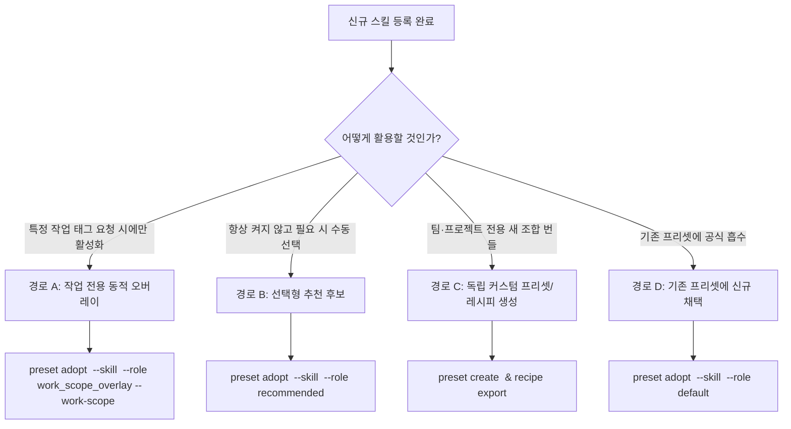

# 스킬 추가 완벽 가이드북 (Skill Addition & Integration Guide)

> **상태**: Canonical Operation Guide v1.0  
> **기준 일자**: 2026-09-14  
> **적용 대상**: Skills Platform에 새로운 스킬을 작성, 검증, 등록하고 프로젝트에 조합·적용하려는 개발자, 에이전트 및 기여자.  
> **핵심 철학**: **Open Composability Substrate** — 특정 아키텍처 공식을 강제하지 않고, 단일 책임 스킬을 작성하여 필요에 따라 독립형·오버레이·커뮤니티 프리셋으로 자유롭게 조합한다.

---

## 1. 스킬 추가의 5단계 엔드투엔드 흐름

Skills Platform에서 스킬을 추가하는 작업은 단순한 마크다운 파일 생성이 아닙니다.  
**기획 → 작성·정적 검증 → 레지스트리 등록·검토 → 개방형 조합 바인딩 → 계획 적용 및 실제 호출 확인**의 5단계를 거쳐 완전한 전달과 동작을 보장합니다.

```text
[Step 1. 설계 & 스코핑]
  │  - 단일 목적 원칙(Single Responsibility)
  │  - 타겟 프로바이더(Codex, Antigravity, Portable) 선정
  │  - 점진적 공개(Progressive Disclosure) 파일 구조 결정
  ▼
[Step 2. 패키지 작성 & 정적 검증]
  │  - skills-packages/<category>/<skill-name>/ 디렉터리 생성
  │  - SKILL.md 및 지원 파일 작성
  │  - CLI 정적 검사 (skill validate / source inspect)
  ▼
[Step 3. Registry 임포트 & 출처 검토]
  │  - import-local 로 불변 리비전 생성
  │  - source review approve 로 출처 승인 (require_approved 정책 필수)
  │  - skill profile set 으로 목적·사용 조건·태그 메타데이터 등록
  ▼
[Step 4. 개방형 조합 바인딩 (Open Composability)]
  │  - 획일적 기본 번들 강제 배제
  │  - 선택지: 작업별 동적 오버레이 / 추천 후보 / 독자 프리셋·레시피 생성 / 기존 프리셋 채택
  ▼
[Step 5. 계획 확인, 적용 및 호스트 발견 검증]
  │  - project-plan / history record-plan 으로 계획 수립 및 preview
  │  - history apply --confirm 으로 adapter 파일 시스템 전달
  │  - 등록 ➔ 선택 ➔ 파일 전달 ➔ 호스트 발견 ➔ 실제 호출 5단계 확인
```

---

## 2. Step 1: 설계 및 스코핑 (Design & Capability Scoping)

스킬을 작성하기 전에 작업 범위와 대상 환경을 명확히 정의합니다.

### A. 핵심 설계 원칙
1. **단일 목적 원칙 (Single Responsibility)**: 하나의 스킬은 하나의 명확한 작업(예: "TypeScript 마이그레이션", "버그 최소 재현 진단")에 집중해야 합니다. 만능 도구(God-tool)나 방대한 가이드를 한 스킬에 몰아넣지 마십시오.
2. **점진적 공개 (Progressive Disclosure)**: `SKILL.md` 진입점은 고신호(high-signal)의 절차적 지침만 담고, 상세한 API 스키마, 정책, 방대한 예제는 `references/` 또는 `resources/` 하위 파일로 분리하여 필요할 때만 모델이 읽도록 설계합니다.
3. **지침과 강제의 분리**: 텍스트 프롬프트는 안전 강제 경계가 아닙니다. 파괴적 명령 차단이나 비밀 유출 방지는 컴패니언 훅/가드([`docs/guides/hook-system-and-protojson-spec.md`](./hook-system-and-protojson-spec.md))를 통해 기계적으로 제어해야 합니다.

### B. 대상 프로바이더 규격 확인

| 항목 | OpenAI Codex | Google Antigravity | Portable (공용 스킬) |
| :--- | :--- | :--- | :--- |
| **필수 Frontmatter** | `name`, `description` | `description` (`name`은 폴더명 기본) | `name`, `description` 모두 작성 |
| **설명(Description) 규칙** | 무엇을 하는지 + 구체적 트리거 시점 명시 | 무엇을 하는지 + 구체적 트리거 시점 명시 | 구체적 트리거 시점 명시 |
| **프로젝트 검색 경로** | `.agents/skills/` | `<workspace>/.agents/skills/` | `.agents/skills/` |
| **지원 서브디렉터리** | `scripts/`, `references/`, `assets/`, `agents/` | `scripts/`, `examples/`, `resources/` | `scripts/`, `references/` |
| **추가 설정 파일** | `agents/openai.yaml` (선택적) | Antigravity 확장 설정 | 프로바이더 독립적 작성 권장 |

---

## 3. Step 2: 패키지 작성 및 정적 검증 (Authoring & Validation)

### A. 디렉터리 배치
새 스킬의 표준 원본은 `skills-packages/` 아래 적절한 카테고리 디렉터리에 배치합니다:
- `skills-packages/platform-core/`: 플랫폼 핵심 및 거버넌스 관련
- `skills-packages/community-codex/`: 커뮤니티 기여 Codex 스킬
- `skills-packages/paperthin/`: 고밀도 코딩 반사신경 스킬
- `skills-packages/<new-category>/`: 새로운 도메인 또는 커뮤니티 전용 카테고리

```text
skills-packages/<category>/<my-skill>/
├── SKILL.md                 # 필수: 스킬 진입점 및 지침
├── references/              # 선택: 상세 스키마, 정책, 딥 다이브 자료 (Codex)
│   └── detailed-guide.md
├── resources/               # 선택: Antigravity 호환 리소스
├── scripts/                 # 선택: 결정론적 자동화 스크립트 (실행 권한 필수)
│   └── helper.sh
└── hooks.json               # 선택: 스킬에 번들링할 컴패니언 훅 정의
```

### B. `SKILL.md` 템플릿 예시
```markdown
---
name: my-specialized-skill
description: >-
  Specific action and purpose of this skill. Use when the user requests X,
  or when analyzing Y under condition Z.
---

# My Specialized Skill

Short overview of the skill's purpose.

## Quick Workflow

1. Step one of the procedure.
2. Step two of the procedure.
3. If deep investigation is required, read [references/detailed-guide.md](references/detailed-guide.md).

## Guidelines & Invariants

- Invariant 1: Never mutate unmanaged files.
- Invariant 2: Always verify output with exit code 0.
```

### C. CLI 정적 유효성 검사 실행
파일 작성 후, 카탈로그 CLI를 통해 프로바이더별 규격과 링크 무결성을 검사합니다.

```bash
# Codex 규격 검사
node apps/skills-catalog/src/cli.js skill validate \
  ./skills-packages/<category>/<my-skill> --provider codex

# Antigravity 규격 검사
node apps/skills-catalog/src/cli.js skill validate \
  ./skills-packages/<category>/<my-skill> --provider antigravity

# 패키지 구조 및 임포트 가능 여부 검사
node apps/skills-catalog/src/cli.js source inspect \
  ./skills-packages/<category>/<my-skill>
```
`source inspect` 결과에서 `importable: true`와 함께 `summary.status`에 심각한 `error`가 없어야 합니다.

---

## 4. Step 3: Registry 임포트 및 출처 검토 (Registry Ingestion & Review)

정적 검사를 통과한 패키지는 불변 리비전(Immutable Revision) 형태로 플랫폼 레지스트리에 임포트합니다.

### A. 패키지 임포트
```bash
node apps/skills-catalog/src/cli.js import-local \
  ./skills-packages/<category>/<my-skill> \
  --registry ./.skills-platform/registry \
  --skill my-specialized-skill
```
*출력되는 `source_revision_id`(예: `revision_abc...`)와 `lineage_id`(예: `lineage_123...`), `registry_skill_id`를 기록합니다.*

### B. 출처 검토 및 승인 (Source Review Approval)
Skills Platform은 기본적으로 `require_approved` 정책을 준수합니다. 검토 기록이 없는 리비전은 배포 계획(`plan`)에서 활성화할 수 없습니다.

```bash
node apps/skills-catalog/src/cli.js source review approve <REVISION_ID> \
  --catalog ./.skills-platform/catalog \
  --registry ./.skills-platform/registry \
  --summary "SKILL.md frontmatter, 점진적 공개 구조, 보안 위험 및 프로바이더 정적 검사 결과 확인 완료."
```

### C. 스킬 프로필 메타데이터 등록
검색과 카탈로그 탐색을 돕기 위해 프로필 메타데이터를 설정합니다:

```bash
node apps/skills-catalog/src/cli.js skill profile set <LINEAGE_ID> \
  --catalog ./.skills-platform/catalog \
  --registry ./.skills-platform/registry \
  --purpose "특정 도메인의 고속 분석 및 자동화 지원" \
  --use-when "사용자가 해당 작업을 명시적으로 요청하거나 복잡한 상태 진단 시" \
  --tag "domain-x" --tag "automation"
```

---

## 5. Step 4: 개방형 조합 바인딩 (Open Composability & Combination)

새로 추가된 스킬을 프로젝트에 어떻게 결합할지 결정합니다.  
**원칙**: 모든 프로젝트에 무차별적으로 기본 장착(Default)하지 마십시오. 작업 맥락에 맞게 느슨하게 결합(Loose Coupling)합니다.



### 경로 A: 특정 작업 전용 동적 오버레이 (Work Scope Overlay) — *가장 권장됨*
일상 코딩 중에는 비활성화되어 있다가, 사용자가 `--work-scope <tag>`로 해당 작업을 지시할 때만 기본셋 위에 가볍게 합성됩니다.
```bash
node apps/skills-catalog/src/cli.js preset adopt <TARGET_PRESET_ID> \
  --skill <REGISTRY_SKILL_ID> \
  --role work_scope_overlay \
  --work-scope domain-x \
  --priority 15 \
  --catalog ./.skills-platform/catalog \
  --registry ./.skills-platform/registry
```

### 경로 B: 선택형 추천 후보 (Recommended)
프로젝트에 '관련 있는 유용한 스킬'로 연결해 두되, 자동 설치하지 않고 사용자가 원할 때 명시적으로 채택하도록 등록합니다.
```bash
node apps/skills-catalog/src/cli.js preset adopt <TARGET_PRESET_ID> \
  --skill <REGISTRY_SKILL_ID> \
  --role recommended \
  --catalog ./.skills-platform/catalog \
  --registry ./.skills-platform/registry
```

### 경로 C: 독립형 커뮤니티 프리셋 및 레시피 생성 (Custom Preset & Recipe)
새로운 작업군을 위한 독자적인 조합을 구축하고, 재현 가능한 JSON 파일로 내보냅니다.
```bash
# 1. 새 프리셋 생성
node apps/skills-catalog/src/cli.js preset create my-team-preset \
  --name "My Team Specialized Preset" \
  --skill <REGISTRY_SKILL_ID> \
  --catalog ./.skills-platform/catalog \
  --registry ./.skills-platform/registry

# 2. 공유 가능한 레시피 JSON으로 내보내기
node apps/skills-catalog/src/cli.js recipe export \
  --preset my-team-preset \
  --name "My Team Recipe" \
  --out ./recipes/tier4-ecosystem/my-team-recipe.json \
  --catalog ./.skills-platform/catalog \
  --registry ./.skills-platform/registry
```
*새로운 레시피는 [`recipes/index.json`](../../recipes/index.json) 매니페스트에 등록하여 카탈로그 탐색 패싯에 추가할 수 있습니다.*

---

## 6. Step 5: 계획 확인, 적용 및 호스트 발견 검증 (Plan, Apply & Verification)

바인딩이 완료되면 실제로 대상 프로젝트의 파일 시스템에 전달하고, 에이전트가 정상적으로 인식하는지 검증합니다.

### A. 계획 생성 및 확인 (Project Plan Preview)
```bash
node apps/skills-catalog/src/cli.js project-plan <PROJECT_ID> \
  --catalog ./.skills-platform/catalog \
  --registry ./.skills-platform/registry \
  --work-scope domain-x \
  --enabled-only
```
출력에서 대상 스킬의 심볼릭 링크/복사본이 올바른 경로(예: `.agents/skills/my-specialized-skill`)로 계획되었는지 확인합니다.

### B. 계획 저장 및 최종 적용
```bash
# 1. 계획 이력 저장
node apps/skills-catalog/src/cli.js history record-plan <PROJECT_ID> \
  --catalog ./.skills-platform/catalog \
  --registry ./.skills-platform/registry \
  --work-scope domain-x \
  --enabled-only \
  --out ./my-plan.json

# 2. 확인 후 파일 시스템에 안전하게 적용 (--confirm 필수)
node apps/skills-catalog/src/cli.js history apply <PLAN_ID> \
  --confirm \
  --catalog ./.skills-platform/catalog \
  --registry ./.skills-platform/registry
```

### C. 5단계 무결성 검증 체크리스트 (5-Stage Verification)

단순히 파일이 생성되었다고 해서 작업이 완료된 것이 아닙니다. 다음 5단계를 체크하십시오:

- [ ] **1. 등록 (Registry)**: `skills-catalog skill list`에서 스킬 리비전과 다이제스트가 조회되는가?
- [ ] **2. 선택 (Selection)**: `skills-catalog project resolve <PROJECT_ID> [--work-scope <tag>]` 결과에 스킬이 포함되어 있는가?
- [ ] **3. 전달 (Delivery)**: 프로젝트의 `.agents/skills/<my-skill>/SKILL.md` 파일 또는 심볼릭 링크가 정확히 존재하는가?
- [ ] **4. 발견 (Discovery)**: 대상 에이전트 호스트(Codex CLI, Antigravity IDE 등)를 실행했을 때 스킬이 사용 가능한 목록에 나타나는가?
- [ ] **5. 호출 (Invocation)**: 실제 프롬프트 요청 시 모델이 스킬 지침을 읽고 기대한 절차대로 도구를 호출하거나 답변을 생성하는가?

---

## 7. 스킬 추가 시 체크리스트 (Authoring & Ingestion Checklist)

새로운 스킬을 PR로 제출하거나 플랫폼에 영구 반영하기 전 점검 사항:

1. **스키마 및 린트**:
   - `name`은 소문자, 숫자, 하이픈(`-`)만 사용했는가?
   - `description`에 스킬의 핵심 기능과 구체적 실행 트리거가 명확한가?
   - `npm run check` (TypeScript 검사) 및 `npm test`가 통과하는가?
2. **비밀 정보 보호**:
   - `SKILL.md`, 스크립트, 예제 파일에 API Key, 토큰 등 비밀 정보가 하드코딩되지 않았는가?
3. **의존성 명시**:
   - 추가 도구(`jq`, `curl`, `python` 등)가 필요하다면 `SKILL.md` 상단에 명시적으로 사전 요구사항으로 적었는가?
4. **결합도 점검**:
   - 이 스킬이 없으면 다른 기본 스킬이 작동하지 않는 강한 커플링을 유발하지 않았는가? (느슨한 결합 준수)
5. **레시피/인덱스 등록**:
   - 공유 레시피를 생성했다면 [`recipes/index.json`](../../recipes/index.json)에 적절한 탐색 패싯(Discovery Facet)과 태그를 함께 업데이트했는가?

---

*관련 참고 문서:*
- [커뮤니티 레시피 및 프리셋 가이드](../../recipes/README.md)
- [스킬 작성 프로바이더 라우터](../../skills-packages/platform-core/skill-authoring-standard/SKILL.md)
- [스킬 작성 참고 카탈로그](../skill-authoring-reference-catalog.md)
- [훅 시스템 및 프로토 사양서](./hook-system-and-protojson-spec.md)
