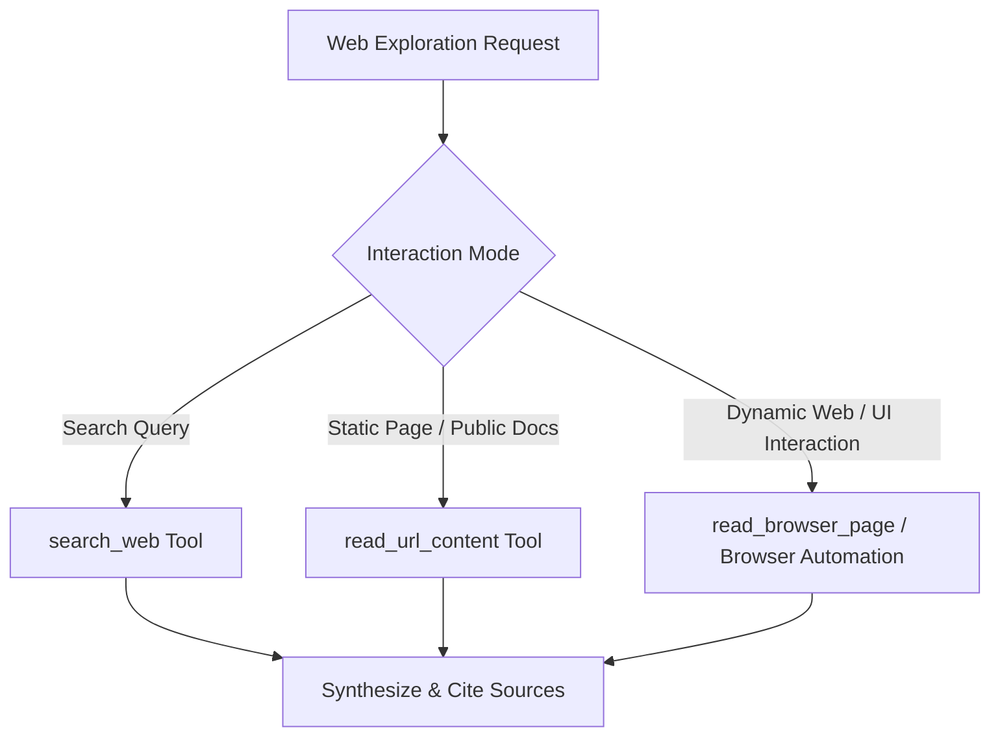

# Browser: Web Navigation & Extraction Protocol (`/browser`)

The `/browser` skill enables seamless web interaction, research lookups, and static/dynamic documentation retrieval.

---

## 🌐 Tool Selection Guide

| Need | Primary Tool | Characteristics |
| :--- | :--- | :--- |
| **Finding Information / Tech Research** | `search_web` | Fast query execution, returns citations and summary. |
| **Reading Public Docs / Articles** | `read_url_content` | Fast HTTP fetch, converts HTML to clean Markdown, no JS execution overhead. |
| **Interactive Pages / Web App Testing** | Browser DevTools / Automation | Full JavaScript rendering and interaction support. |

---

## 📋 Citation & Integrity Guidelines
- Always link original documentation sources when synthesizing solutions.
- Prefer official vendor documentation (MDN, official API docs, GitHub release notes) over unverified forum posts.
