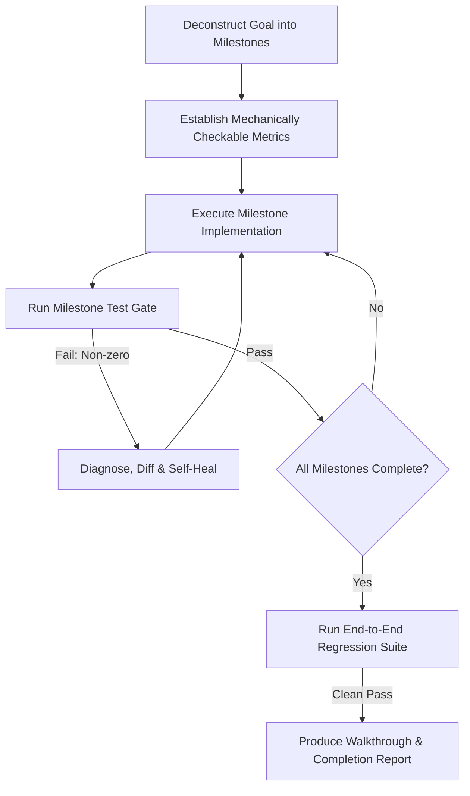

# Goal-Driven Autonomous Execution (`/goal`)

The `/goal` protocol enables long-running, self-directed execution where the agent operates with maximum persistence, systematically resolving build failures, test breakages, and edge cases until the mission is accomplished.

---

## 🛡️ Core Operating Rules for `/goal`

1. **Relentless Persistence**: Never surrender or prematurely stop upon encountering unexpected runtime exceptions, flaky network calls, or syntax errors. Systematically debug the root cause.
2. **Objective Verification Gate**: Every milestone MUST have a deterministic programmatic check (e.g. `npm test`, custom validation script, integration benchmark).
3. **Artifact-Driven State Machine**: Maintain a live status dashboard in `implementation_plan.md` checking off milestones in sequence (`[ ]` ➔ `[x]`).
4. **Subagent Delegation for Deep Dives**: When encountering complex isolated sub-problems, invoke `research` or specialized subagents to investigate in parallel while keeping the main loop focused.
5. **No Hallucinated Success**: Completion is only declared when the end-to-end regression test suite passes with exit code `0`.
