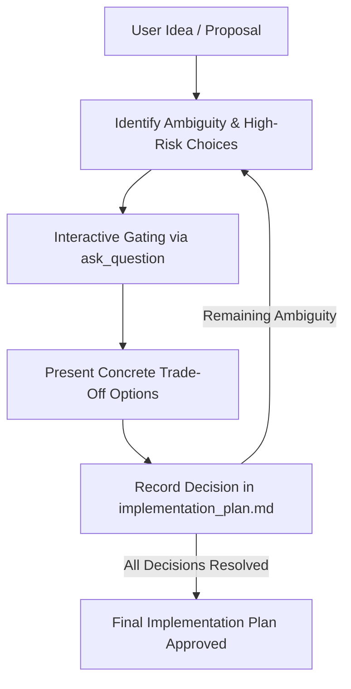

# Grill-Me: Interactive Design Alignment & Stress Testing

`/grill-me` is a pre-implementation alignment protocol. It prevents premature coding by rigorously probing design decisions, concurrency models, error boundaries, and technical trade-offs.

---

## 🎯 4 Core Tenets of Grilling

| # | Tenet | Operational Rule |
| :---: | :--- | :--- |
| **1** | **Probe What, Not Just How** | Uncover hidden assumptions about scale, consistency, data persistence, and failure recovery. |
| **2** | **Structured Choices** | Use `ask_question` with concrete technical options (trade-off matrices) instead of vague open-ended queries. |
| **3** | **No Self-Decision on High-Impact Ambiguities** | If a choice impacts API contracts, security, or data migration, present explicit options to the operator. |
| **4** | **Living Design Artifact** | Continuously distill interview outcomes directly into `implementation_plan.md`. |

---

## 📋 Interview Dimensions to Probe

| Dimension | Key Probing Questions |
| :--- | :--- |
| **Scope & Boundaries** | What is explicitly out of scope? PoC vs Production grade? |
| **Data & State Management** | Source of truth? Mutation patterns? In-memory vs persistent storage? |
| **Error Handling & Faults** | Fail-fast vs graceful degradation? Retry policies and idempotency? |
| **Concurrency & Race Conditions** | Parallel execution safety? Distributed locks or optimistic locking? |
| **Verification Strategy** | How will success be measured mechanically? Test fixtures available? |

---

## 🔄 Grilling Workflow

1. **Scan Draft**: Analyze the proposal against the 5 probing dimensions.
2. **Execute Interactive Rounds**:
   - Pose 1–3 focused questions per round using `ask_question`.
   - Provide concrete alternatives: Option A (e.g. Fast in-memory), Option B (e.g. Robust SQLite), Option C (e.g. External service).
3. **Update Artifact**: Reflect decisions into `<appDataDir>\brain\<conversation-id>/implementation_plan.md`.
4. **Final Gate**: Conclude when all architectural unknowns are resolved and present the final plan for user sign-off.
