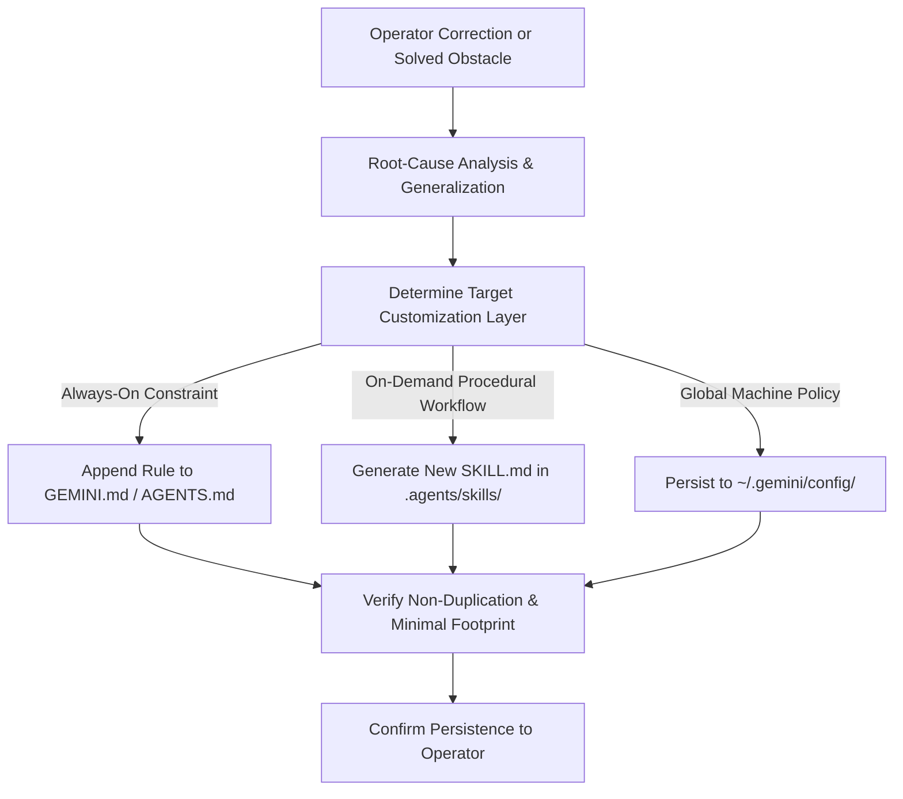

# Learn: Knowledge & Rule Synthesis Protocol (`/learn`)

The `/learn` protocol captures transient lessons, debugging breakthroughs, and operator corrections, transforming them into permanent, version-controlled rules (`GEMINI.md`, `AGENTS.md`) or modular workspace skills (`.agents/skills/`).

---

## 🏛️ Rule Selection Hierarchy

| Target | File Location | When to Choose |
| :--- | :--- | :--- |
| **Workspace Rule** | `.agents/rules/*.md` or `GEMINI.md` | Universal constraints, coding standards, prohibited commands, path invariants. |
| **Workspace Skill** | `.agents/skills/<name>/SKILL.md` | Multi-step runbooks, deployment guides, complex setup scripts. |
| **Global Config** | `~/.gemini/config/GEMINI.md` | User-wide preferences applicable across all repositories. |

---

## 📝 Synthesis Rules

1. **High Signal-to-Noise**: Never record overly verbose logs or conversation transcripts. Distill down to crisp, actionable rules.
2. **Prevent Rule Bloat**: Check if existing rules already cover the concept; merge and refine rather than creating redundant entries.
3. **Format**: Follow the official YAML frontmatter convention for skills, or clean markdown alerts for rules.
