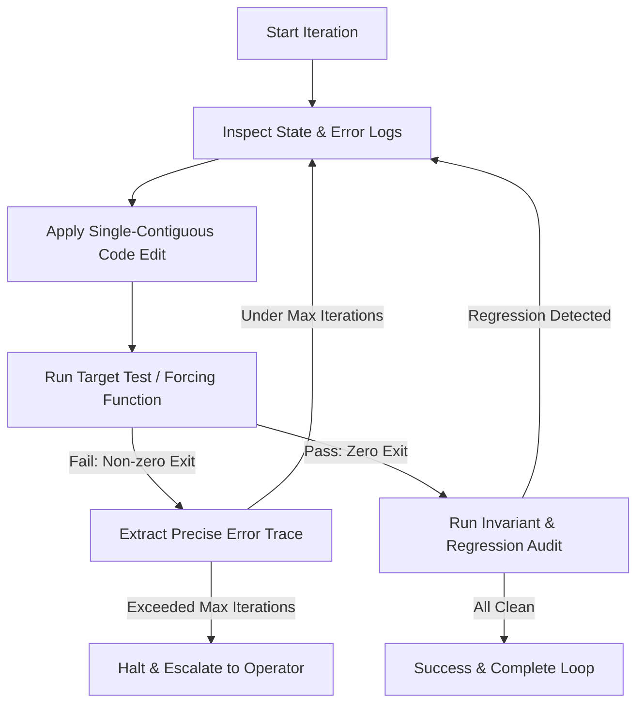

# Ralph Autonomous Inner Loop (`ralph-loop`)

The **Ralph Loop** is an autonomous, verification-driven execution cycle designed to prevent premature self-certification and force empirical debugging until all acceptance criteria are met.



---

## 🛡️ 4 Invariants of the Ralph Loop

| # | Invariant | Rule |
| :---: | :--- | :--- |
| **1** | **Mechanical Forcing Function** | Never infer or guess test results. Only actual test execution exit codes (`0`) constitute a pass. |
| **2** | **Tight Diff Locality** | Make surgical, single-responsibility changes per cycle. Avoid sweeping multi-file rewrites without verification. |
| **3** | **No Premature Exit** | Never terminate the loop while tests fail or regressions exist. If stuck, analyze diff against baseline. |
| **4** | **Clean Baseline Gate** | Every cycle must verify both the target test AND baseline regression suite before completion. |

---

## 🔄 Execution Protocol

### Step 1: Establish the Target Test
Identify or write the isolated test file/command that objectively measures success:
```bash
# Example forcing function command
npm test -- test/target-feature.test.js
```

### Step 2: Inner Iteration Cycle
1. **Analyze Failure**: Read compiler errors, stack traces, or assertion diffs.
2. **Apply Surgical Fix**: Use `replace_file_content` to adjust code.
3. **Execute Test**: Run the target test via `run_command`.
4. **Evaluate**:
   - If **failed**: Do not apologize or speculate. Log exact line failure and loop back to Step 2.1.
   - If **passed**: Proceed to Step 3.

### Step 3: Regression & Invariant Audit
Run the broader test suite and invariant check to ensure no peripheral features broke:
```bash
npm test
```

### Step 4: Finalize & Walkthrough
Once all tests pass cleanly, document the verified changes, test output summaries, and final status in `walkthrough.md`.
