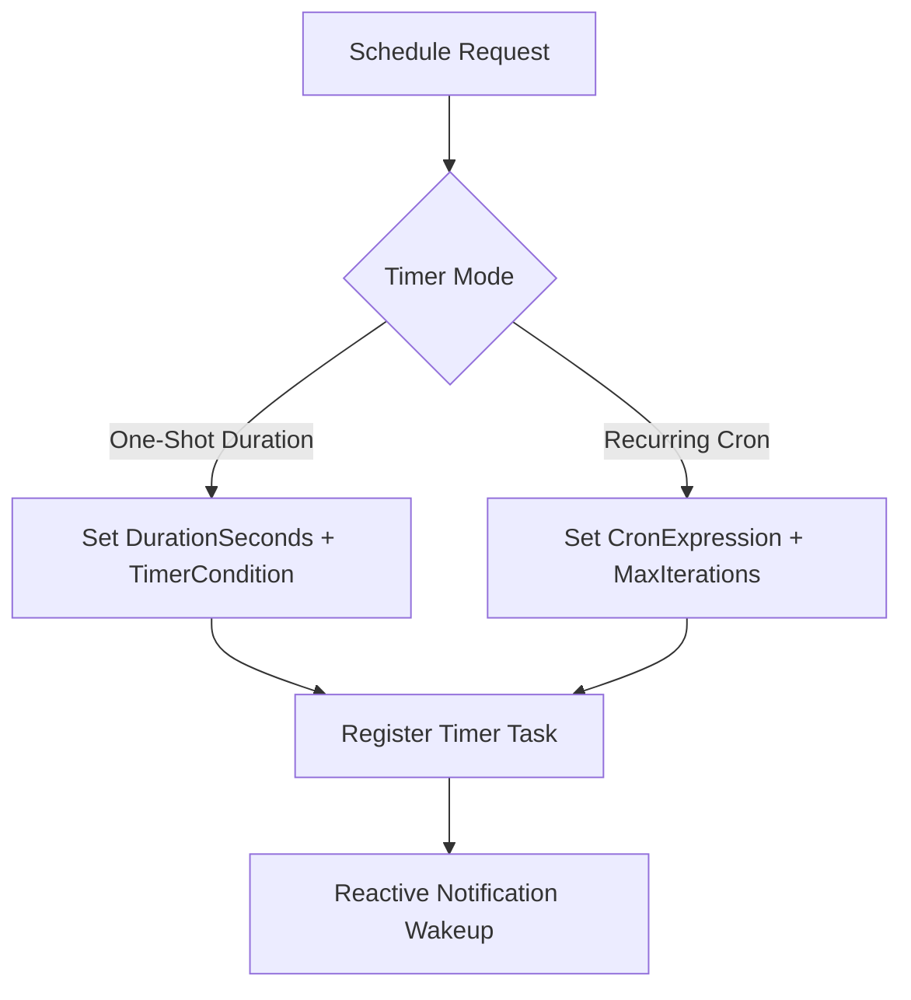

# Schedule: Background Timers & Cron Orchestration (`/schedule`)

The `/schedule` skill guides the agent in using the native `schedule` tool to manage background timers, recurring polling jobs, and health check monitors.

---

## ⏱️ Scheduling Patterns

### 1. One-Shot Timers
- **Unconditional (`TimerCondition: 'never'`)**: Set when an absolute delay is needed (e.g. reminder in 10 minutes).
- **Reactive Liveness (`TimerCondition: 'any'` or `<sender-id>`)**: Set when waiting for background tasks or subagents, waking up early if messages arrive.

### 2. Recurring Cron Jobs
- **Task-Bound Monitoring (`IsDaemon: false`)**: Polling a deployment or test runner every minute until completion.
- **Standing Background Job (`IsDaemon: true`)**: Daily summaries or continuous repo health monitors that outlive current tasks.

---

## ⚠️ Key Operational Invariants
- **NEVER run `sleep` in shell commands** to delay execution. Always use the native `schedule` tool.
- Stop calling tools to yield execution while waiting for timer notifications.
