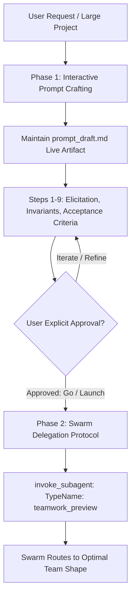

# Teamwork Multi-Agent Coordination (`/teamwork-preview`)

Google Antigravity's official autonomous multi-agent teamwork framework.



---

## 🔄 Two-Phase Workflow Overview

1. **Phase 1 (Prompt Crafting & Calibration)**: Interactively refine project scope, integrity mode, and objective verification mechanisms through Steps 1–9 using `prompt_draft.md`.
2. **Phase 2 (Autonomous Swarm Delegation)**: Upon explicit user sign-off, extract the final prompt and invoke `teamwork_preview` via `invoke_subagent`.

> [!IMPORTANT]
> Both phases are strictly required. Crafting without delegation is incomplete; delegating without prompt calibration causes poor results.

---

## 🏛️ 4 Core Architectural Principles

| # | Principle | Operational Rule |
| :---: | :--- | :--- |
| **1** | **Specify What, Not How** | Define user goals and acceptance criteria. Avoid prescribing implementation details (internal file names, algorithms, library choices) unless explicitly requested. |
| **2** | **Objective Verification** | Every requirement must have an objective forcing function (programmatic test or agent-as-judge rubric) independent of implementing agent self-assessment. |
| **3** | **Acceptance Criteria = Guardrails** | Use concrete, checkable conditions to prevent premature self-certification of half-baked work. |
| **4** | **Minimal Requirements** | Only specify what the user strictly cares about. Let teamwork infer and optimize the rest. |

---

## 📝 Living Artifact Workflow (`prompt_draft.md`)

Maintain `<appDataDir>\brain\<conversation-id>/prompt_draft.md` throughout the process using `write_to_file` (`UserFacing: true`). Create it immediately with this scaffold:

```markdown
# Teamwork Project Prompt — Draft

> Status: Step 1 — Eliciting project idea
> Goal: Craft prompt → get user approval → delegate to teamwork_preview
> Requested team: [none — teamwork routes from the description]

[Project description — 1-2 sentences]

Working directory: [TBD]

## Requirements

### R1. [TBD]

### R2. [TBD]

## Acceptance Criteria

### [TBD]
- [ ] [TBD]

---
*Next: when approved → delegate via invoke_subagent (see Delegation Protocol)*
```

---

## 🚀 9-Step Interactive Prompt Crafting Flow

Prefer `ask_question` when presenting structured choices to the user.

### Step 1: Elicit the Idea
- Ask: What do you want to build? What is the purpose (demo, production, eval, exploration)? Who is the audience?
- Capture in 1-2 sentences in `prompt_draft.md`.

### Step 2: Identify Ambiguity & Scale
- Probe scope, constraints, and external dependencies.
- **Effort & Scale (Opt-in Choices)**:
  - *Small focused team*: For a single self-contained bugfix or refactor. Open prompt with: `"This is a single self-contained fix; keep it small and focused."`
  - *Proof, very large team*: For hard math/formal proofs requiring 100+ agents. Open prompt with: `"Use a very large team of agents."`

### Step 3: Determine Integrity Mode
Ask behavioral questions via `ask_question` (`is_multi_select: true`) on allowed shortcuts:
- `development` (Default, no restrictions)
- `demo` (Partial external libraries allowed, fast prototyping)
- `benchmark` (Strict zero-shortcut evaluation)

### Step 4: Draft Requirements (R1, R2...)
- Write 2–5 blocks describing **what** is needed (1–3 sentences each).
- Litmus test: *"Would a skilled engineer feel over-constrained?"* ➔ If yes, remove implementation hints.

### Step 5: Design Objective Verification (The Forcing Function)
- Create an objective test target (bot scripts, benchmark suites, test runners) that **forces** real debugging loops.
- Incorporate user-provided test suites or reference implementations under `## Verification Resources`.

### Step 6: Set Acceptance Criteria
- Convert verification into concrete checkable items (`- [ ]`). Calibrate bar to purpose (demo vs production vs eval).

### Step 7: Infrastructure Constraints
- If external access is required (cloud storage, compute clusters), specify controlled API constraints.

### Step 8: Choose Working Directory
- Set project root (Default: `~/teamwork_projects/{PROJECT_NAME}`).

### Step 9: Assemble, Validate & Present
- Ensure `prompt_draft.md` follows standard scaffold.
- Verify against validation checklist (no implementation hints, objectively checkable criteria, opt-in teams declared).
- Present final prompt to user and request approval.

---

## 👥 Swarm Team Topologies & Routing

`teamwork_preview` automatically inspects the prompt and selects the optimal team shape:

| Team Shape | Trigger Condition | Composition |
| :--- | :--- | :--- |
| **Full Team** *(Default)* | Builds, systems architecture, monorepo refactors | Orchestrator, Explorers, Milestone Workers, 5-Agent Review Panel |
| **Small Focused Team** *(Opt-in)* | Single self-contained fix, localized module patch | 1 Implementer + Repeated Adversarial Reviewers |
| **Document Review** | Formal papers, RFCs, security audit specs | Document Analyst, Security Auditor, Synthesis Lead |
| **Proof Pipeline** | Mathematical problem solving, formal logic | Prover, Step Validator, Counterexample Searcher |
| **Proof, Very Large Team** *(Opt-in)* | Extreme parallel search (100+ agents) | Multi-cluster agent nodes |

---

## ⚡ Delegation Protocol

When the user gives explicit approval ("go", "launch", "looks good", "run it"):

1. **Extract**: Copy the entire prompt text directly from `prompt_draft.md`.
2. **Invoke**: Call `invoke_subagent` with:
   - `TypeName: "teamwork_preview"`
   - `Role: "Teamwork Swarm Coordinator"`
   - `Prompt: "<full_prompt_text>"`
3. **Update Status**: Set `prompt_draft.md` status to `Launched`.

---

## 🚫 Critical Anti-Patterns

| ❌ Anti-Pattern | Operational Risk |
| :--- | :--- |
| **Pass File Path Instead of Text** | Passing `prompt_draft.md` path fails if the file changes; always copy full text. |
| **Early Delegation** | Spawning subagents before user confirms prompt causes misalignment. |
| **Skip Artifact** | Leaving user without visibility into prompt structure. |
| **Adding How by Default** | Restricting the swarm's solution space with unnecessary architecture constraints. |

---

## 📚 References & Guides

- **Multidimensional Matrix Axes Platform**: [Skills-Docs / docs / matrix-axes](../../../Skills-Docs/docs/matrix-axes/index.md)
- **Detailed 9-Step Runbook**: [references/nine-step-workflow.md](./references/nine-step-workflow.md)
- **Swarm Team Shapes**: [references/team-shapes.md](./references/team-shapes.md)
- **Prompt Scaffold Template**: [examples/prompt-draft-template.md](./examples/prompt-draft-template.md)
