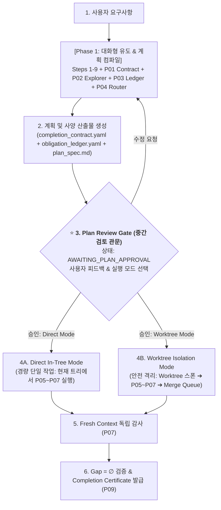

# LCH Teamwork Preview (`lch-teamwork-preview`)

Deterministic, state-backed multi-agent teamwork orchestrator that bridges human conversational ease with mathematical completion contracts.

---

## 🏛️ 2-Phase Lifecycle with Post-Planning Review Gate

---

## 📋 Phase 1: 9-Step Interactive Elicitation (대화형 유도)

Throughout Phase 1, maintain the live artifact `prompt_draft.md` and use `ask_question` for structured choices.

1. **Step 1: Elicit the Idea**: Capture 1-2 sentence core purpose and audience.
2. **Step 2: Identify Ambiguity & Team Scale**: Probe scope, tech stack, and ask about scale (Small focused team vs Full team vs Large-scale proof).
3. **Step 3: Determine Integrity Mode**: Behavioral multi-select (`development` | `demo` | `benchmark`).
4. **Step 4: Draft Requirements ($R_1 \dots R_n$)**: Define **What Not How**.
5. **Step 5: Design Objective Verification**: Specify programmatic tests or rubrics (Forcing Function).
6. **Step 6: Set Acceptance Criteria**: Define concrete, checkable criteria.
7. **Step 7: Infrastructure Constraints**: Controlled APIs (network, storage, job dispatch).
8. **Step 8: Choose Working Directory**: Default `~/teamwork_projects/{name}`.
9. **Step 9: Compile Planning Ledgers**:
   * Auto-generate `completion_contract.yaml` ($C$) via `lch-contract-compiler` (P01).
   * Run horizontal scan to generate `horizontal_context.yaml` ($B_t$) via `lch-horizontal-explorer` (P02).
   * Break down obligations into `obligation_ledger.yaml` ($P_t$) via `lch-obligation-ledger` (P03).
   * Bind change boundaries in `responsibility_binding.yaml` ($R_t$) via `lch-responsibility-router` (P04).

---

## 🛑 Review Gate: Post-Planning Checkpoint (중간 검토 관문)

> [!IMPORTANT]
> **검토 관문 불변식 (Review Gate Invariant)**:  
> 계획 문서(계약서, 의무 원장, 사양서) 작성이 완료되면 파이프라인은 **즉시 코드를 수정하지 않고 일시 중지(Halt)**하며 사용자 승인을 대기합니다.

### 2.1 검토 요청 시 제공되는 아티팩트
* `completion_contract.yaml` (목표, 수용 검사, 비목표)
* `obligation_ledger.yaml` (원자적 의무 목록 및 의존성 DAG)
* `plan_spec.md` (기술 사양서)

### 2.2 사용자 선택 옵션 (`ask_question`)
1. **`(Recommended) [Proceed: Direct Mode]`**: 추가 워크트리 오버헤드 없이 현재 작업 트리에서 수술적 패치 즉시 실행.
2. **`[Proceed: Worktree Mode]`**: 격리된 Git Worktree를 스폰하고, 검증 통과 후 순차 병합 큐(Merge Queue)를 거쳐 메인에 안전 병합.
3. **`[Revise Plan]`**: 비목표, 수용 검사 또는 의무 우선순위를 수정하고 계획 문서를 재컴파일.

---

## ⚡ Phase 2: Execution & Decoupled Verification (실행 및 독립 검증)

1. **선택된 모드에 따라 실행 착수**:
   * **`Direct Mode`**: 현재 작업 디렉터리에서 `lch-work-unit-executor` (P05)가 Context Pack을 받아 수술적 패치(`proposed_done`) 생성.
   * **`Worktree Mode`**: `spawnProcedureWorkspace()`로 독립 Git Worktree 생성 후 P05 실행 ➔ `enqueueWorkspace()`로 병합 큐 적재.
2. **증거 수집**: `lch-evidence-collector` (P06)가 I/O 및 diff 캡처.
3. **Fresh Context 독립 감사**: `lch-independent-auditor` (P07)가 $L0 \sim L6$ 검증 실행 (`pass` | `fail`).
4. **실패 시 복구**: `lch-failure-recovery` (P08)가 차원을 변경하여 재시도.
5. **종료 및 인증서 발급**: `lch-closure-gate` (P09)가 $\text{Gap}_t = \varnothing$ 확인 후 `completion_certificate.yaml` 발급.

---

## 🛡️ 시스템 불변조건 (Invariants)

1. **사전 검토 불변식**: 계획 및 문서 컴파일 후 사용자의 명시적 승인 없이 코드 수정 진입 불가.
2. **모드 유연성**: 작업 규모에 따라 `direct`와 `worktree`를 사용자가 자유롭게 선택.
3. **자가 인증 원천 차단**: Worker는 수정안(`proposal`)만 제출 가능하며, 승격은 오직 P07 Auditor만 수행.
4. **영속성 동기화**: 모든 계획과 상태 전이는 `@skills-platform/ledger-store`에 실시간 기록.
