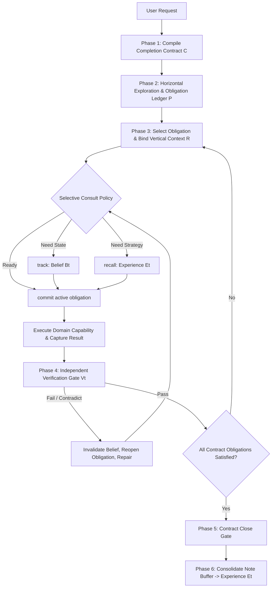

# Logical Completion Core (`logical-completion-core`)

A procedural runtime harness that shifts working memory and execution control from the model's implicit context into explicit, verified external state.

$$
S_t = (C,\ B_t,\ P_t,\ E_t,\ V_t,\ R_t)
$$



---

## 🏛️ 1. The 6 External State Components

| State Component | Operational Invariant & Purpose |
| :--- | :--- |
| **`C` — Completion Contract** | Immutable goals, deliverables, constraints, non-goals, and explicit acceptance tests. Never edited directly during execution. |
| **`B` — Belief State** | Facts observed from the environment (`epistemic_status: observed \| inferred \| assumed \| contradicted`). Observation always overrides memory. |
| **`P` — Progress (Obligation Ledger)** | Active ledger of obligations (`pending \| active \| blocked \| satisfied \| failed \| waived`). Tasks CANNOT close with open obligations. |
| **`E` — Experience Store** | Bounded, LFU-pruned library of reusable procedures, failure modes, and anti-patterns. |
| **`V` — Verification Ledger** | Decoupled verification records from independent validators (automated tests, linters, schemas, diff assertions). |
| **`R` — Responsibility Scope** | Authority boundary, owned files (`allowed_change_scope`), and handoff targets. |

---

## 🛠️ 2. Meta-Actions & Control Protocol

### State Meta-Actions (Selective Access)
* **`track(subject)`**: Query verified facts from Belief $B_t$. Call when previous actions mutated state or when current state is stale.
* **`commit(obligation_id, status)`**: Register a new obligation or update status in Progress $P_t$.
* **`recall(query, context)`**: Query strategies or failure warnings from Experience $E_t$. Call on new topics or after first-attempt failures.
* **`note(content, evidence_refs)`**: Stage a reusable lesson or failure cause into the temporary note buffer.

### Control Actions
* **`verify(check_id, target)`**: Run the independent verification tool.
* **`reopen(obligation_id, reason)`**: Revoke premature satisfaction and resume active debugging.
* **`reframe(topic_id, reason)`**: Return to horizontal exploration when vertical context binding is flawed.
* **`close(contract_id)`**: Perform final contract evaluation. Succeeds ONLY when all obligations are satisfied or explicitly waived.

---

## 🛡️ 3. The 10 Invariants of Logical Completion

1. **No Action Without a Contract**: Never execute code changes before compiling $C$.
2. **One Vertical Topic at a Time**: Keep attention bounded; never work on multiple disparate topics simultaneously.
3. **Observation Overrides Experience**: Current environment facts immediately invalidate contradicting prior memories.
4. **Obligations Are Not To-Do Lists**: Every obligation must bind to a contract requirement, owner, and verification proof.
5. **Decoupled Verification**: The agent that wrote the code cannot self-certify without running the external verification tool.
6. **No Silent Dropping**: Blocked or failed obligations must be resolved or formally `waived` with proof.
7. **Notes Are Staged, Not Instant Memory**: `note` writes to a staging buffer; consolidation occurs post-close.
8. **Inconclusive is Not a Pass**: Inability to verify is marked `inconclusive` and blocks completion.
9. **Out-of-Bounds Changes Prohibited**: Never touch files outside $R$'s `allowed_change_scope`.
10. **Zero-Guess Completion**: Completion is only asserted when every contract gate passes with verified evidence.

---

## 🔄 4. Execution Workflow

### Step 1: Compile Completion Contract (`write_to_file`)
Create `<appDataDir>\brain\<conversation-id>/completion_contract.md`:
```yaml
completion_contract:
  goal: "Clear statement of required end state"
  deliverables: ["List of required outputs"]
  acceptance_tests:
    - id: A1
      condition: "Objectively checkable success condition"
      verifier: "Exact command or validation rubric"
  constraints: ["Allowed change scopes, prohibited actions"]
  non_goals: ["Explicitly out-of-scope items"]
```

### Step 2: Initialize Obligation Ledger
Register active obligations ($O_1, O_2, \dots$) required to satisfy all acceptance tests.

### Step 3: Consult & Execute
1. Evaluate Consult Policy: Is `recall` or `track` needed?
2. `commit(O_k, active)`
3. Execute domain action via tool capability.
4. `verify(A_k, target)`: Run independent test/linter.
5. If test fails: Invalidate Belief, `reopen(O_k)`, diagnose and repeat.
6. If test passes: Mark `satisfied` with test log evidence.

### Step 4: Close Contract & Consolidate
Once all obligations reach `satisfied`:
1. Execute `close(contract_id)`.
2. Consolidate note buffer into new Experience entries for future runs.
