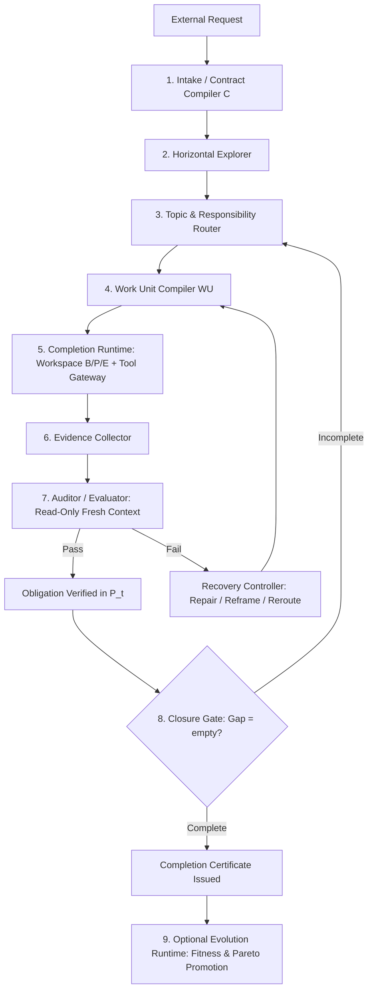

# Logical Completion Harness (`logical-completion-harness` v0.1)

A procedural runtime harness and governance kernel that controls task execution through state transitions rather than implicit prompt instructions.

$$
S_t = (C,\ B_t,\ P_t,\ E_t,\ V_t,\ R_t,\ A_t)
$$



---

## 🏛️ 1. Core Architecture & The 3 Planes

1. **Completion Plane**: Responsible for solving the active task strictly according to the Completion Contract.
2. **Verification Plane**: Decoupled, read-only evaluation that independently audits claimed results against deterministic evaluators.
3. **Evolution Plane** *(Optional)*: Iteratively explores and benchmarks multiple candidates ($X_t = (L, H, F, G, Q)$) for Pareto optimization without violating contracts.

### Kernel vs. Model Proposal Boundary

| Operation | Model Role | Kernel / Harness Role |
| :--- | :--- | :--- |
| Topic candidates | Propose | Validate & Register |
| Solution hypotheses | Propose | Scope check |
| Tool invocations | Propose | Authority & Budget check |
| Belief updates | Propose with evidence | Commit to $B_t$ |
| Obligation completion | Claim (`proposed_done`) | **Cannot self-certify** |
| Verification result | Prohibited | Auditor / Evaluator only |
| Baseline promotion | Prohibited | Promotion Gate only |
| Contract modification | Propose patch | Versioned approval only |

---

## 📊 2. The 7-State Runtime Model ($S_t$)

* **`C` (Completion Contract)**: Immutable definition of done (goals, deliverables, acceptance checks, non-goals, stop conditions).
* **`B` (Belief State)**: Observed environment facts (`observed > inferred > assumed > contradicted`).
* **`P` (Progress Ledger)**: Obligation lifecycle (`pending ➔ ready ➔ active ➔ proposed_done ➔ verified | failed | blocked`).
* **`E` (Experience Store)**: LFU-pruned lessons, failure modes, and staged note buffers.
* **`V` (Verification Ledger)**: Deterministic evaluation records ($L0$ to $L6$).
* **`R` (Responsibility Scope)**: Allowed change boundary (`allowed_change_scope`, owned files).
* **`A` (Artifact & Baseline)**: Incumbent baseline and isolated candidate workspaces.

$$
\text{Gap}_t = A_{\text{required}} - V_t, \quad \text{Termination Goal: } \text{Gap}_t = \varnothing
$$

---

## 👥 3. Strict Role Separation

* **Manager**: Horizontal discovery, topic selection, obligation creation, work unit compilation. *(Cannot patch code, cannot certify verification).*
* **Executor**: Executes Work Unit within tool gateway, produces candidate patches, claims completion proposal. *(Cannot mark verified, cannot mutate baseline).*
* **Auditor**: Fresh context, read-only acceptance check execution, captures raw evidence. *(Cannot edit source code, cannot change test expectations).*
* **Evaluator**: Deterministic validation suites (tests, typecheck, AST lint, DOM contract, CLI exit codes).
* **Supervisor**: Stagnation detection, plateau diagnosis, escalation to human. *(Cannot directly patch code).*

---

## 🛡️ 4. The 29 System Invariants (Core Rules)

1. Never execute without a compiled **Completion Contract ($C$)**.
2. Only **one active vertical topic** per execution lane ($1 \text{ lane} = 1 \text{ active topic} = 1 \text{ primary obligation}$).
3. All execution is bounded by an **Atomic Work Unit ($WU$)**.
4. Model outputs are strictly **proposals**, never authoritative state.
5. Executors **cannot transition obligations to `verified`**.
6. Auditors **cannot modify artifacts or test baselines**.
7. Experience **never overrides current environment observations**.
8. `note` entries are staged in buffer; never directly committed to permanent memory.
9. Claims without **captured evidence** do not mutate ledgers.
10. Evaluator crashes or ambiguous outputs are marked **`inconclusive`**, never `pass`.
11. Actions exceeding **`allowed_change_scope`** are aborted by Tool Gateway.
12. Baselines are never mutated before **Promotion Gate verification**.
13. Never repeat the **exact same action on the exact same state** after a failure.
14. Cost optimizations are compared only between **successful runs**.
15. Contract fulfillment and quality evolution are **strictly separated**.
16. Event logs are **append-only**; semantic states update via versioning.
17. A formal **Completion Certificate** must be issued upon run closure.
18. *(For complete 29 invariants list, see [references/system-invariants.md](./references/system-invariants.md))*

---

## 🔄 5. Execution Workflow

```text
Intake Request
  ↓
Compile Contract (C)
  ↓
Horizontal Exploration (Discover Topics)
  ↓
Bind Single Vertical Topic (R)
  ↓
Compile Work Unit (WU) & Fresh Context Pack
  ↓
Executor Run (via Tool Gateway)
  ↓
Evidence Collector
  ↓
Independent Auditor (Pass / Fail / Inconclusive)
  ├── Fail ➔ Recovery Controller (Repair / Reframe / Reroute)
  └── Pass ➔ Verify Obligation (P_t)
        ↓
  Closure Gate Check
        ↓
  Issue Completion Certificate
```

---

## 📚 References & Detailed Specifications

- **[System Architecture & 3 Planes](./references/system-architecture.md)**
- **[State Model & Work Unit Compiler](./references/state-model-and-work-unit.md)**
- **[Roles, Capabilities & Tool Gateway](./references/roles-and-tool-gateway.md)**
- **[Verification Hierarchy & Recovery Controller](./references/verification-and-recovery.md)**
- **[Evolution Plane & Stagnation Supervisor](./references/evolution-and-stagnation.md)**
- **[The 29 System Invariants](./references/system-invariants.md)**
