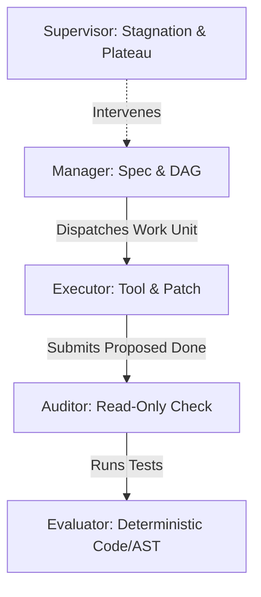

# 👥 Roles, Capabilities & Tool Gateway

## 1. 5 Core Runtime Roles

1. **Manager**: Decomposes contract into Topic DAG and Work Units. Never touches source files.
2. **Executor**: Implements changes within the isolated Candidate Workspace. Proposes `proposed_done`.
3. **Auditor**: Fresh context agent. Executes acceptance checks; issues `pass`, `fail`, or `inconclusive`.
4. **Evaluator**: Deterministic CLI / AST / DOM testing engine (`exit code 0` enforcement).
5. **Supervisor**: Monitors plateau states and consecutive non-promotions.

---

## 2. Tool Gateway & Capability Effects

All tool calls pass through the Capability Registry and are intercepted by safety gates:

| Effect Grade | Meaning | Pre-Execution Guard |
| :--- | :--- | :--- |
| **`read-only`** | Reads files/environment without side effects | Allowed if within discovery scope |
| **`reversible-write`** | Modifies files in candidate worktree | Path must match `allowed_change_scope` |
| **`external-write`** | Writes to external DB / remote services | Explicit contract approval required |
| **`destructive`** | File deletion / process kill / reset | Human-in-the-loop escalation |
| **`privileged`** | Secret access / infrastructure changes | Authority policy validation |
